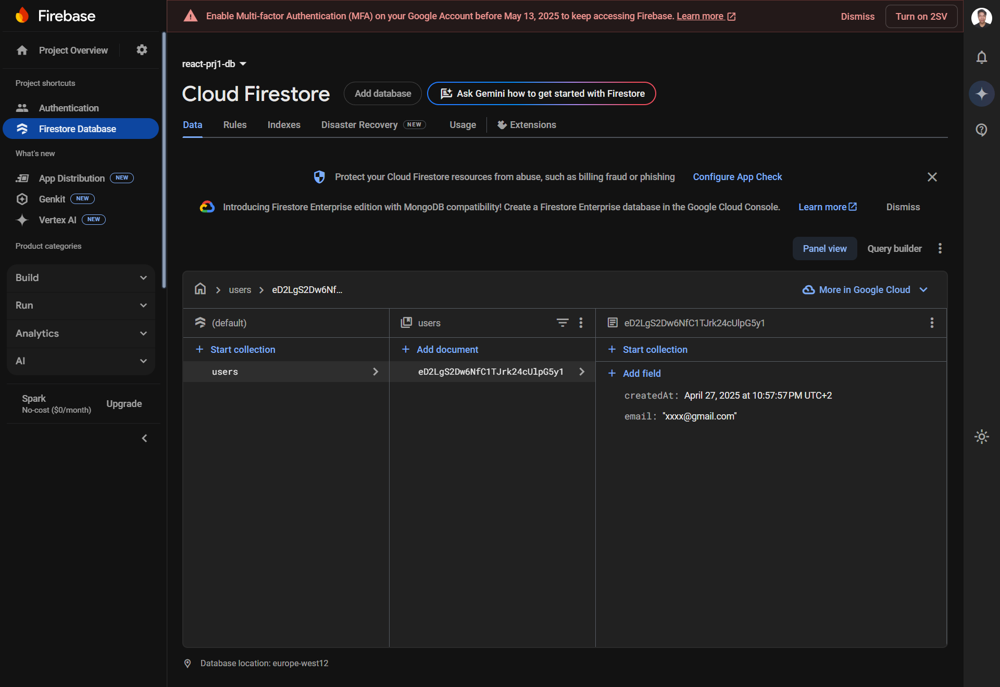
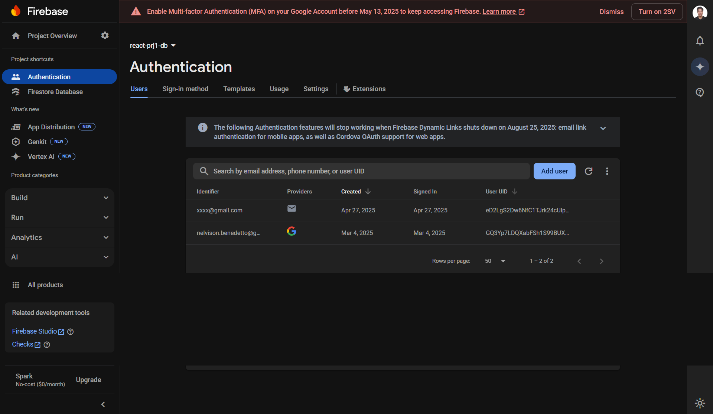

## Amazon Sign-Up/Sign-In Simulation using Firebase Authentication
output:

Developed a React application that simulates the sign-up and sign-in functionality of Amazon using Firebase Authentication and Firestore. The application allows users to sign up via email and password, and sign in using Google authentication. Firebase Authentication is used to handle the authentication process, while Firestore stores user details, including their email and account creation timestamp, in a secure database. The app includes real-time authentication state management, ensuring the UI is updated when users log in or log out. Key features include secure sign-in with Google and email/password authentication, as well as Firebase profile management for user data storage. The app is built using modern React patterns, with Firebase SDK for seamless integration of authentication and database services.

